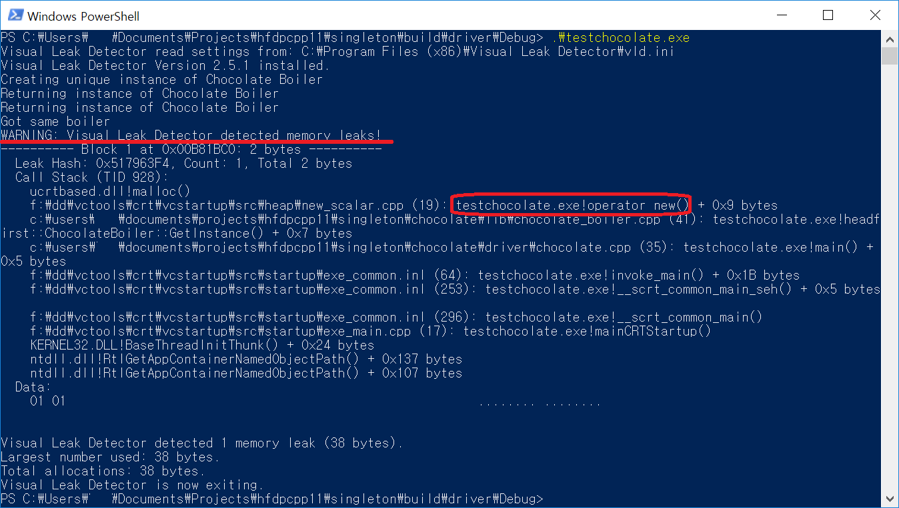

*****************
Singleton Pattern
*****************

`영어 <README.rst>`_ 로

Test
----

This project uses cmake so wide range of OSes are supported. For ubuntu, you can 
compile as shown below::

 mkdir build
 cd build/
 cmake -DCMAKE_BUILD_TYPE=Debug ../chocolate/
 make
 ./driver/testchocolate

+------------------------------------------------------------------------------+
|패턴 6. 싱글턴                                                                |
+==============================================================================+
|해당 클래스의 인스턴스가 하나만 만들어지고, 어디서든지 그 인스턴스에 접근할 수|
|있도록 하기 위한 패턴                                                         |
+------------------------------------------------------------------------------+

Chocolate Boiler
================

Class Diagram
-------------

.. image:: chocolate/imgs/Overview_of_Chocolate_Boiler.jpg
   :scale: 50 %
   :alt: Class Diagram

두가지 코드가 제시되었다. chocolate 는 책의 자바 코드를 그대로 가져온 방식이라면
chocolate_meyers 는 책에서 소개하지 않은 Meyers 라는 사람이 제시한 C++ 의 싱글턴
이 적용되어있다. C++ 에서는 chocolate 과 같은 방식으로 싱글턴을 구현하면 안된다!
chocolate 에는 멀티쓰레드상에서의 동기화 문제도 발생할 수 있으며 보통은 무시하는
정도이지만 메모리 유출도 방치되어있다. chocolate_meyers 에는 이러한 멀티쓰레드 하
에서의 동기화 문제가 C++11 이 규정한 언어수준의 규약에 따라 이 문제가 해결되었
다. 또한 메모리 유출 현상도 발생하지 않는다.

